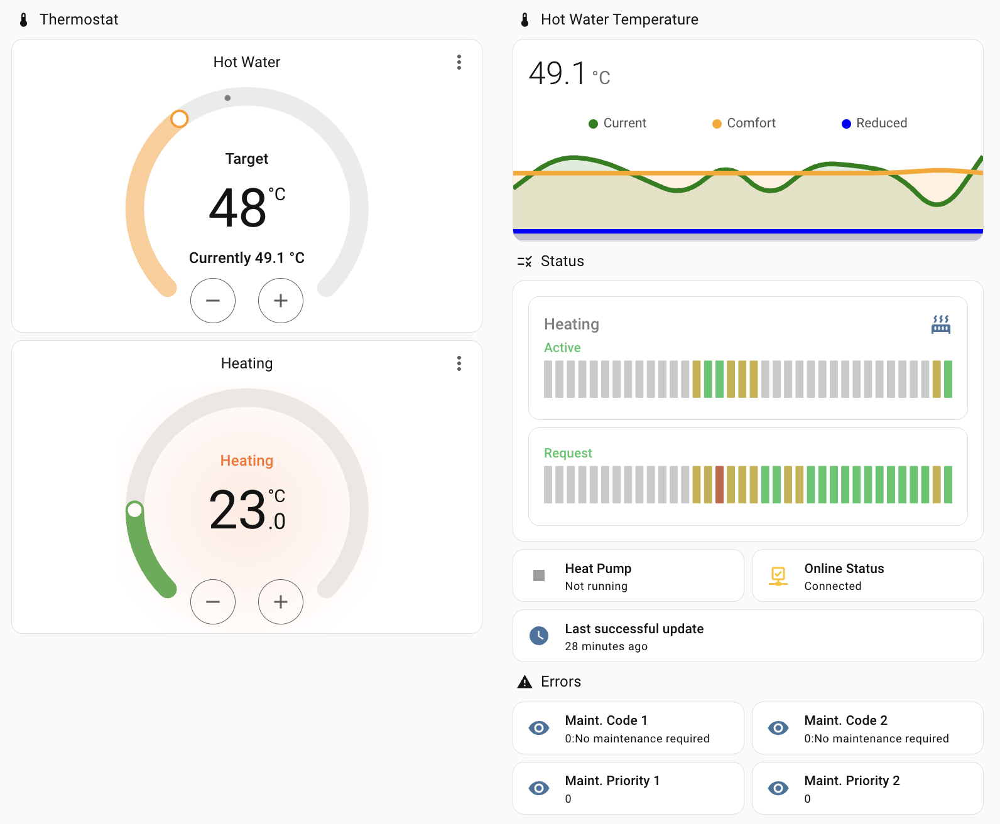

<p align="center">
  
</p>

<h1 align="center">ELCO Aerotop for Home Assistant</h1>

<p align="center">
  A native Home Assistant integration for monitoring and controlling ELCO Aerotop heat pumps through Remocon.net.
</p>

<p align="center">
  <a href="https://github.com/thomasgregg/elco-aerotop/actions/workflows/validate.yml"></a>
  <a href="LICENSE"></a>
  
</p>

## Contents

- [Overview](#overview)
- [What you can do](#what-you-can-do)
- [Entities](#entities)
- [How data is discovered](#how-data-is-discovered)
- [Installation](#installation)
- [Home Assistant setup](#home-assistant-setup)
- [Options](#options)
- [Write-safety model](#write-safety-model)
- [Availability and refresh behavior](#availability-and-refresh-behavior)
- [Diagnostics and privacy](#diagnostics-and-privacy)
- [Troubleshooting](#troubleshooting)
- [Compatibility](#compatibility)
- [Development](#development)

## Overview

ELCO Aerotop brings a Remocon-connected heat pump into Home Assistant as one native device. It is
intended for everyday monitoring, heating and hot-water control, automations, and troubleshooting
without having to open the Remocon website.

The integration uses the structured JSON endpoints behind Remocon.net. It is a **cloud-polling**
integration, so it requires internet access and a working Remocon.net account; it does not connect
directly to the heat pump over the local network.



## What you can do

| Use case | Home Assistant experience |
|---|---|
| Monitor the system | Temperatures, pressure, flow values, operating state, and heat demand |
| Control room heating and cooling | A thermostat for each supported zone, with cooling controls while Remocon reports cooling active |
| Control hot water | A native water-heater entity with target temperature and operating mode |
| Tune heating behavior | Allowlisted controls for holiday level, frost setpoint, heating curve, and summer/winter limit |
| Build automations | Use temperatures, demand, operating state, and holiday periods as inputs |
| Find problems | Controller errors, probe faults, maintenance codes, and appliance-health data |
| Check the installation | Gateway connectivity, plant status, controller model, owner, location, and gateway version |
| Investigate efficiency | Optional historical heat, cooling, input-energy, and performance records |

The exact controls and readings depend on what the gateway reports. Unsupported capabilities are
not presented as working controls, while temporarily missing controller values become unavailable
instead of being guessed.

```text
Home Assistant entities
          │
          ▼
ELCO Aerotop coordinator ──► Remocon.net cloud ──► ELCO gateway ──► Heat pump
          │
          └── one fresh, validated and serialized request path for all writes
```

Setup is handled through the Home Assistant interface with no YAML required. Heating zones and
available values are discovered automatically. The default polling interval is one hour, writes
are serialized and validated against current gateway data, and authentication renewal is handled
through Home Assistant's normal reauthentication flow.

## Entities

All entities belong to the ELCO Aerotop device, and the exact set is determined by the gateway's
capabilities. The default device page focuses on native thermostat and hot-water controls,
everyday measurements, and important fault information. Alternative controls, specialist
diagnostics, low-level BSB values, and the 80 historical energy entities are available but mostly
disabled by default to avoid overwhelming a normal installation. All eight entities belonging to
each annual energy record now share a common display-name prefix.

The [entity reference](docs/entities.md) contains the complete tables, entity-ID patterns, default
states, creation conditions, read/write behavior, and explanations of maintenance, holiday, and
energy values. Existing entity IDs and enabled/disabled choices are preserved during upgrades;
new defaults apply only when an entity is first registered.

Remocon installation metadata is exposed as diagnostic entities when its JSON APIs return a
value. This includes gateway online state, overall plant status, appliance model and serial,
plant owner, account language, plant name/location, gateway serial, and gateway version. Owner
phone fields are optional and disabled by default. The controller's read-only clock is exposed as
a diagnostic timestamp. A separate **Last successful update** timestamp records when the
integration most recently completed a core Remocon data capture, including successful polls whose
values did not change. Remocon's **Connectivity Gateway** software
value and the integration's **Gateway firmware** value both come from `gwFwVer`; the integration
creates one version sensor and also reuses that value in Home Assistant's device information.

## How data is discovered

Remocon gateways differ by controller, firmware, and installed options. The integration therefore
starts with the capabilities and values reported by the gateway, then performs additional
read-only discovery for:

- plant and gateway information, live connectivity/status, and owner metadata;
- heating, hot-water, zone, and controller-bus values;
- schedules and holiday periods;
- errors, maintenance messages, and appliance-health information; and
- metering and historical energy records.

Core heating data loads first. Slower optional requests run independently in the background, so an
unsupported schedule, maintenance, or BSB endpoint does not prevent the integration from loading.
A temporarily failed datapoint becomes unavailable and is restored automatically after a
successful read.

All runtime data comes from structured JSON endpoints; rendered web pages are not scraped. The
integration also avoids scanning arbitrary controller addresses because unsupported BSB requests
can delay a gateway. New response fields are captured in redacted diagnostics and become entities
only after their meaning, unit, and availability behavior have been verified.

For endpoint coverage, maintenance and energy implementation details, and the anonymized fixture
workflow, see [Gateway discovery and anonymized fixtures](docs/discovery.md).

## Installation

### Option 1: HACS (recommended)

[](https://my.home-assistant.io/redirect/hacs_repository/?owner=thomasgregg&repository=elco-aerotop&category=integration)

HACS must already be installed and configured in Home Assistant. Until the default-store listing
is approved, use the button above or add this repository as a custom repository:

1. Open **HACS** in Home Assistant.
2. Open the three-dot menu in the upper-right corner and choose **Custom repositories**.
3. Enter this repository URL:

   ```text
   https://github.com/thomasgregg/elco-aerotop
   ```

4. Select **Integration** as the category and choose **Add**.
5. Search HACS for **ELCO Aerotop** and choose **Download**. After the default-store listing is
   approved, new users can start directly with this step.
6. Restart Home Assistant when HACS asks you to do so.
7. Continue with [Home Assistant setup](#home-assistant-setup).

These steps follow the [HACS custom-repository procedure](https://www.hacs.xyz/docs/faq/custom_repositories/).

### Option 2: Manual installation

1. Download or clone this repository.
2. Copy the complete `custom_components/elco_aerotop` directory into your Home Assistant
   configuration directory:

   ```text
   <home-assistant-config>/custom_components/elco_aerotop
   ```

3. Verify that `manifest.json` is directly inside that directory—not inside another nested
   `elco-aerotop` folder.
4. Restart Home Assistant.
5. Continue with [Home Assistant setup](#home-assistant-setup).

### Home Assistant setup

1. Go to **Settings → Devices & services**.
2. Select **Add integration**.
3. Search for **ELCO Aerotop**.
4. Enter the requested connection details and submit the form.

| Field | Required | Default | Description |
|---|:---:|---|---|
| Email | Yes | — | Email address used to sign in to Remocon.net. |
| Password | Yes | — | Remocon.net account password. |
| Gateway ID | Yes | — | Identifier at the end of the plant dashboard URL. It is normalized to uppercase. |
| Remocon.net URL | No | `https://www.remocon-net.remotethermo.com` | Service base URL. Keep the default unless the plant uses another branded Remocon endpoint. |

The gateway ID is normally the final part of a dashboard URL, for example:

```text
https://www.remocon-net.remotethermo.com/BsbPlantDashboard/Index/GATEWAY_ID
```

One gateway can only be configured once. Multiple gateways may be added as separate integrations.

## Options

Open **Settings → Devices & services → ELCO Aerotop → Configure** to change the polling interval.

| Option | Default | Minimum | Maximum | Notes |
|---|---:|---:|---:|---|
| Polling interval | 3,600 seconds | 60 seconds | 3,600 seconds | The default is one hour. A shorter interval increases traffic to the undocumented Remocon service. |

This option controls the normal plant, zone, and system-item refresh. The slower read-only
discovery families—schedules, maintenance, automated monitoring, controller diagnostics, and
energy history—run once in the background after setup and then approximately every 60 minutes.
Their cadence is calculated from the selected polling interval, so choosing a shorter normal poll
does not make these controller-heavy requests run unnecessarily often, and the one-hour default
does not postpone them for 12 hours.

The integration reloads automatically when the option changes. A successful write also requests
an immediate state refresh; it does not wait for the next scheduled poll.

## Write-safety model

Remocon's write endpoints expect related values together, even when only one Home Assistant entity
changes. Sending an incomplete or stale request can be ignored by the controller or overwrite a
companion value. Every write therefore follows this sequence:

1. Acquire a per-device command lock.
2. Stop optional background discovery and acquire the shared gateway-traffic lock.
3. Fetch uncached state only for the affected zone, or one zone plus plant state for a DHW change.
4. Validate the requested value against current gateway limits or allowed options.
5. Enforce the relationship between comfort and reduced temperatures.
6. Preserve all unchanged companion values required by the endpoint.
7. Send the typed command once through the dedicated Remocon endpoint. An explicit `401`/`403`
   rejection may renew the session and replay once because the unauthenticated request was rejected.
8. Never resend a command after a timeout, disconnect, or ambiguous server failure. When Remocon
   permits another request, perform one uncached read to determine whether the command took effect.
9. Refresh core Home Assistant state without launching slow discovery behind the write.

If the verification read confirms the requested values, Home Assistant treats the command as
successful. If it confirms old values, the command reports that it was not applied. If verification
also fails—or Remocon supplies `Retry-After`—the integration reports that the outcome is unknown
and asks the user to check the controller or official application. This avoids duplicate writes
while still recovering automatically from a lost success response.

Polling and optional discovery use the same gateway-traffic lock. Optional discovery releases it
between requests so a user command can proceed without overlapping controller traffic.

The native and advanced controls are two views of those same validated values:

| User-facing control | Remocon value written | Preserved companion values |
|---|---|---|
| Thermostat target | Active heating or cooling comfort temperature | Matching reduced temperature and current zone payload |
| Thermostat HVAC mode/preset | Zone operating mode | Fresh plant and zone payload |
| Water-heater target | DHW comfort temperature | DHW reduced temperature and current mode |
| Water-heater operation/on/off | DHW mode | DHW comfort and reduced temperatures |
| Advanced number/select | Its corresponding value above | Same companions as the native entity |
| Holiday level and BSB tuning numbers | One exact allowlisted BSB address | Fresh compare-and-set values; controller readback required |

All writable temperature numbers declare Home Assistant's temperature device class and native
degrees Celsius unit, enabling correct temperature semantics and configured-unit conversion.

The integration deliberately does not expose an arbitrary BSB-address write service. New writable
parameters should only be added after their request shape and controller behavior have been
captured and tested.

The thermostat exposes `cool` and writes cooling comfort/reduced values only while a fresh
controller snapshot reports cooling as active. It does not use `HVACMode.COOL` to switch the plant
from heating into cooling; seasonal enablement remains under the controller's own configuration.

## Availability and refresh behavior

- Plant and zone data are coordinated into a single Home Assistant snapshot.
- Normal plant, zone, and system-item values refresh at the configured polling interval: 60
  minutes by default.
- Schedules, maintenance, monitoring, BSB diagnostics, and energy history refresh in a deferred
  background cycle approximately every 60 minutes, independently of the selected normal polling
  interval. Their first deferred refresh starts after entity setup.
- Zone entities are created from the zones discovered during initial setup.
- A zone thermostat is created only when Remocon returns a comfort target and at least one verified
  zone operating mode.
- The water-heater entity is created only when Remocon returns a DHW comfort target and at least
  one verified, allowed DHW mode.
- Optional sensors and binary sensors are created only when their source value exists during that
  initial discovery; unsupported values do not create placeholder entities.
- Writable native, number, and select entities are omitted if Remocon does not provide enough
  information to use them safely. Modes that a particular gateway does not offer are omitted from
  that entity's supported mode list.
- Authentication expiry triggers one controlled login and request replay. A second authentication
  rejection starts Home Assistant's reauthentication flow.
- Rejected credentials start Home Assistant's reauthentication flow.
- A complete multi-zone snapshot is accepted only when every requested zone succeeds; partial data
  from a failed attempt is discarded.
- Core reads immediately retry once after a fast transport interruption, the controller's
  `Communication error`, or HTTP `408`, `500`, `502`, `503`, or `504`. Full timeouts, TLS/certificate
  failures, authentication errors, rate limits, and permanent response errors are not immediately
  retried.
- After a failed core refresh, Home Assistant schedules recovery after 60 seconds, then 5 minutes,
  then 15 minutes, and finally the configured polling interval. Each delay is capped at the normal
  interval, so a short user-selected interval is never made slower by the backoff.
- HTTP `Retry-After` is honored for rate limits and temporary service failures; a rate limit without
  a usable delay defaults to 5 minutes. Parsed server delays are bounded to one day.
- Each HTTP request has a 15-second connection phase, a 65-second response-read phase, and a
  70-second total limit because valid gateways can take close to a minute. A complete `GetData`
  operation has one shared budget of 70 seconds per requested zone, so restarting a failed
  multi-zone snapshot never doubles its maximum duration.
- Deferred optional discovery stops early on a connection/timeout or rate limit, and after two
  consecutive gateway-level `502`–`504` failures. It resumes later without making core heating and
  hot-water entities unavailable.

## Diagnostics and privacy

Home Assistant diagnostics are available from the integration's device page. The export includes
an anonymized data snapshot, endpoint availability, and a `response_schema` map containing every
observed key path and value type. It redacts the configured email, password, gateway ID, common
identity/location fields, serial numbers, technician details, and identifiers embedded in object
keys. Long arrays are bounded to keep the diagnostic file manageable.

Remocon credentials are stored in the Home Assistant config entry and are only sent to the
configured Remocon service. Each entry uses its own cookie session, preventing authentication
cookies from being shared between configured accounts.

The anonymizer is deliberately defensive, but Remocon is undocumented and may introduce a new
identity field. Before sharing diagnostics publicly, inspect the file and remove anything you
consider personal. The project accepts anonymized diagnostics as test fixtures only after review.

## Troubleshooting

### The integration does not appear in Home Assistant

- Confirm the directory is exactly `config/custom_components/elco_aerotop`.
- Confirm `manifest.json` is inside that directory.
- Restart Home Assistant after installing or updating the files.
- Clear the browser cache if the integration search still shows old information.

### Authentication fails

- Sign in to the Remocon.net website with the same email and password.
- Check that the configured base URL is correct for the account.
- Re-enter credentials from **Settings → Devices & services** if Home Assistant reports that the
  integration needs attention.

### A documented entity is missing

Entity availability depends on the data returned by the controller. Zone entities require that
zone to be discovered. Writable numbers require a current value, while selects require a list of
allowed modes. Check diagnostics to see what the integration parsed.

### A write is rejected or does not remain set

- Check that the comfort target is not below the corresponding reduced target.
- Test a small change and verify it in the official Remocon application or on the controller.
- Allow a few moments for the gateway and cloud to synchronize.
- Restore the original value if the system behaves unexpectedly.
- Include the Home Assistant error and a redacted diagnostic file when opening an issue.

### Enable debug logging

Add the following to `configuration.yaml`, restart Home Assistant, reproduce the problem, and then
download the logs:

```yaml
logger:
  default: warning
  logs:
    custom_components.elco_aerotop: debug
```

Remove the override after troubleshooting to avoid unnecessary log volume.

## Compatibility

The integration targets ELCO Aerotop systems exposed through Remocon's BSB plant dashboard. The
cloud API is undocumented and model capabilities vary, so formal compatibility is still being
established.

When reporting a working or non-working model, include the exact Aerotop model, gateway type,
firmware version if known, number of heating zones, and which entities were returned. Do not post
credentials, gateway IDs, serial numbers, or unredacted payloads.

## Development

The reverse-engineered request contract, endpoint selection, and contribution safety rules are
documented in [`docs/protocol.md`](docs/protocol.md).

Create a Python 3.12 or newer environment and install the test dependencies:

```bash
python -m pip install aiohttp pytest pytest-asyncio ruff
```

Run all local checks:

```bash
ruff check .
ruff format --check .
pytest
```

GitHub Actions additionally runs Home Assistant hassfest and HACS repository validation.

## Support and contributions

- Use [GitHub Issues](https://github.com/thomasgregg/elco-aerotop/issues) for reproducible defects
  and compatibility reports.
- Testing reports for write controls, holiday calendars, and schedule discovery are especially
  welcome. Please say exactly what was tested, what the ELCO controller or official application
  showed before and after, and whether Home Assistant matched it.
- Pull requests should include tests for parser changes and every new write payload.

## Disclaimer

This is an unofficial community project and is not affiliated with or endorsed by ELCO, Ariston
Group, or the Remocon.net service. Remocon.net is a cloud service with an undocumented internal API;
upstream changes can break the integration without notice. Use write controls at your own risk.

Licensed under the [MIT License](LICENSE).
